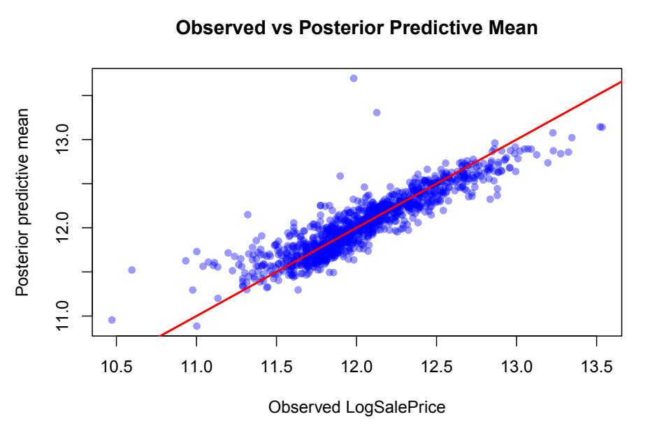
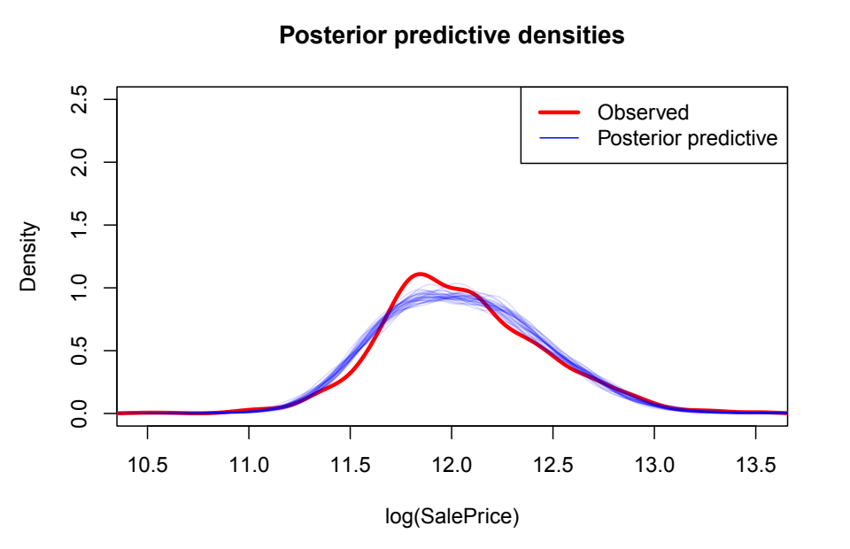
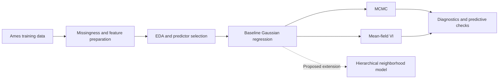

# Bayesian House Price Modeling

**STAT 405 · Bayesian regression, uncertainty, and posterior inference**

**Team: Ruohan Sun, Haoyu You**

How well can a small, interpretable Bayesian model explain house prices—and how
reliable are different methods for approximating its posterior? This project
studies Ames housing data using Gaussian regression on log sale prices, compares
Hamiltonian Monte Carlo (MCMC) with mean-field variational inference (VI), and
specifies a hierarchical extension for neighborhood-level variation.

[Final report](reports/final-report.pdf) ·
[Analysis with outputs](reports/analysis-notebook.pdf) ·
[Reproduce the analysis](docs/reproducibility.md) ·
[中文说明](README.zh-CN.md)

## At a glance

| Item | Project scope |
| :--- | :--- |
| Data | Ames housing, Kaggle House Prices training set |
| Sample | 1,460 original rows → 1,126 after preprocessing |
| Response | Natural logarithm of `SalePrice` |
| Baseline | Five-predictor Bayesian Gaussian regression |
| Inference | Four MCMC chains; mean-field VI on the same model |
| Extension | Neighborhood-specific intercepts and living-area slopes |
| Evaluation | Prior/posterior predictive checks, convergence summaries, **in-sample** error |

> **Scope:** The baseline model was fitted using both methods. The hierarchical
> model is specified in Stan but has not been fitted in the submitted analysis.
> The bike-sharing proposal is retained separately in [archive/](archive/README.md).

## Main findings

The original run produced a stable MCMC fit, while its VI approximation gave an
implausibly large residual scale and poor posterior predictive behavior.

| Reported quantity | MCMC | Mean-field VI |
| :--- | ---: | ---: |
| RMSE, log-price scale | 0.1706 | 5.464 |
| MAE, log-price scale | 0.1200 | 5.069 |
| Posterior mean of residual SD, `sigma` | 0.171 | 3.902 |

These values are transcribed from the [final report, Sections 6–7](reports/final-report.pdf)
and its [executed notebook](reports/analysis-notebook.pdf), not a new fit. RMSE and
MAE compare observed log prices with the mean of posterior predictive draws on
the **same 1,126 training observations**. They are neither dollar-scale errors nor
held-out test scores. The VI failure is a finding about this run, not a general
claim that VI cannot work for housing models.

### A visual look at the MCMC fit

| Observed vs. posterior predictive mean | Posterior predictive densities |
| :---: | :---: |
|  |  |

Figures are cropped from pages 38–39 of the original
[analysis notebook](reports/analysis-notebook.pdf). They show in-sample agreement;
they do not establish out-of-sample performance or interval coverage.

## Models and workflow

The baseline assumes $y_i = \log(\mathrm{SalePrice}_i)$ and
$y_i \sim \mathcal{N}(\mu_i, \sigma^2)$, using these predictors:

| Predictor | Interpretation |
| :--- | :--- |
| `OverallQual` | Overall material and finish quality |
| `LogGrLivArea` | Natural log of above-ground living area |
| `GarageCars` | Garage capacity in cars |
| `TotalBsmtSF` | Total basement area in square feet |
| `YearSinceRemodel` | Sale year minus remodel year |

The proposed hierarchical model adds a varying intercept and a varying
`LogGrLivArea` slope for each neighborhood, with partial pooling and correlated
group effects. See [model details and limitations](docs/methodology.md).



## Explore the repository

| Start here | What you will find |
| :--- | :--- |
| [Final report](reports/final-report.pdf) | Ten-page narrative, findings, limitations, and model appendix |
| [Executed analysis](reports/analysis-notebook.pdf) | Original 46-page notebook with code, tables, and plots |
| [Analysis source](analysis/final-project.Rmd) | Preprocessing, EDA, priors, MCMC, VI, and comparisons |
| [Hierarchical specification](analysis/hierarchical-model.Rmd) | Updated equations consistent with the Stan implementation |
| [Stan models](models/) | Baseline and hierarchical model source |
| [Dataset guide](data/README.md) | File inventory, provenance, and variables |
| [Reproduction guide](docs/reproducibility.md) | Dependencies, commands, outputs, and troubleshooting |
| [Early proposal](archive/README.md) | Superseded bike-sharing topic and backup BMW data |

```text
Bayesian-Statistics-Project/
├── README.md                       # Project overview (English)
├── README.zh-CN.md                 # 项目说明（中文）
├── Bayesian-Statistics-Project.Rproj
├── analysis/                       # R Markdown analysis and model specification
├── R/                              # Probability simulation helpers
├── models/                         # Portable Stan source
├── data/                           # Ames housing CSVs and data dictionary
├── reports/                        # Original submitted PDF snapshots
├── docs/                           # Methodology, reproduction guide, and figures
├── scripts/                        # Environment check and rendering entry point
└── archive/                        # Earlier proposal and its datasets
```

## Run locally

Reading the committed reports requires no R installation. To rerun the analysis,
install R (4.1 or newer), the required R packages, CmdStan, and a C++ toolchain as
described in the [reproduction guide](docs/reproducibility.md).

From the repository root:

```sh
Rscript scripts/check_environment.R
Rscript scripts/render.R analysis html
```

The second command compiles the baseline Stan model, reruns MCMC and VI, and
writes `outputs/final-project.html`. For a PDF, use `analysis pdf` after installing
LaTeX. For the specification alone, use `hierarchical html`; this does not fit a
model. New outputs are ignored by Git so the original report snapshots remain
easy to identify.

The original submission has no dependency lockfile or saved posterior draws.
Exact numerical replication across software versions is therefore not guaranteed.

## Team members

| Member | Main contributions documented in the final report |
| :--- | :--- |
| **Ruohan Sun** | Hierarchical model development, interpretation of comparison results, and final report writing |
| **Haoyu You** | Exploratory data analysis, baseline model implementation, figures, and intermediate results |

## Data and references

- [Kaggle: House Prices — Advanced Regression Techniques](https://www.kaggle.com/competitions/house-prices-advanced-regression-techniques/data) — source of the bundled housing files; see the [local data dictionary](data/house-prices-advanced-regression-techniques/data_description.txt).
- [CmdStanR documentation](https://mc-stan.org/cmdstanr/articles/cmdstanr.html) — R interface, toolchain setup, and posterior computation.
- [Stan correlation matrix distributions](https://mc-stan.org/docs/functions-reference/correlation_matrix_distributions.html) — LKJ prior used by the hierarchical implementation.

The original report and model note describe a uniform correlation prior, whereas
the Stan code uses LKJ(2). The editable specification now follows the code; this
discrepancy and other interpretation limits are recorded in the
[methodology notes](docs/methodology.md).
